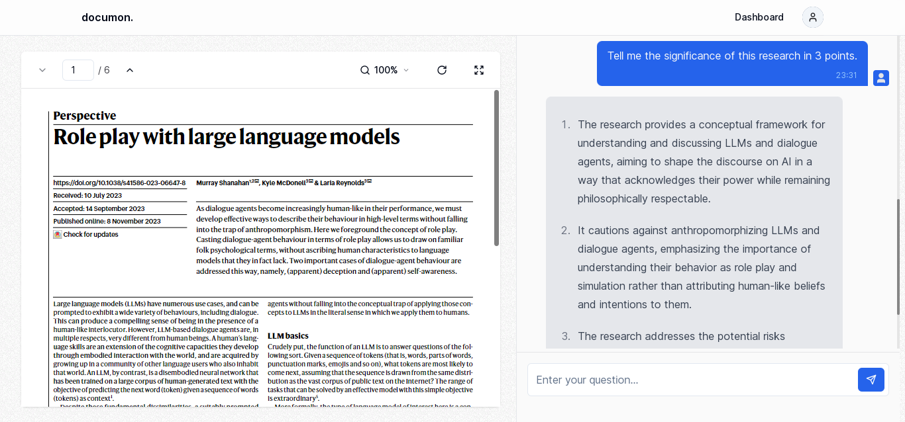

# Documon

A web application that harnesses the power of artificial intelligence to transform the way you interact with PDF documents. Documon enables you to seamlessly engage in a conversation with your PDFs, enjoy smart context summarization, and benefit from annotation features. This makes document exploration and information retrieval a breeze.


## Screenshot



<p align="center">
  <a href="https://documon.nabarun.ai"><strong>View Project »</strong></a>
</p>


## Running Locally

This application requires Node.js v16.13+.

### Cloning the repository to the local machine:
```bash
git clone https://github.com/nabarvn/documon.git
cd documon
```

### Installing the dependencies:
```bash
pnpm install
```

### Running the application:
```bash
pnpm dev
```


## Tech Stack:

- **Language**: [TypeScript](https://www.typescriptlang.org)
- **Framework**: [Next.js](https://nextjs.org)
- **Styling**: [Tailwind CSS](https://tailwindcss.com)
- **Analytics**: [Vercel Analytics](https://vercel.com/analytics)
- **State Management**: [React Query](https://www.npmjs.com/package/@tanstack/react-query)
- **ORM Toolkit**: [Prisma](https://www.prisma.io/docs/concepts/overview/what-is-prisma)
- **LLM Provider**: [OpenAI](https://platform.openai.com/docs/overview)
- **Vector Database**: [Pinecone](https://docs.pinecone.io/docs/overview)
- **Memory Builder**: [LangChain.js](https://js.langchain.com/docs/get_started/introduction)
- **Rate Limiter**: [Upstash](https://docs.upstash.com/redis)
- **MySQL Database**: [PlanetScale](https://planetscale.com/docs/concepts/what-is-planetscale)
- **Authentication**: [Kinde](https://kinde.com/docs/developer-tools/nextjs-sdk)
- **File Hosting**: [UploadThing](https://docs.uploadthing.com)
- **API Typesafety**: [tRPC](https://trpc.io/docs)
- **Payments**: [Stripe](https://stripe.com/docs/payments)
- **Deployment**: [Vercel](https://vercel.com)


## Credits

Learned a ton while building this project. All thanks to Josh for the next level (no pun intended) tutorial!

<hr />

<div align="center">Don't forget to leave a STAR 🌟</div>
